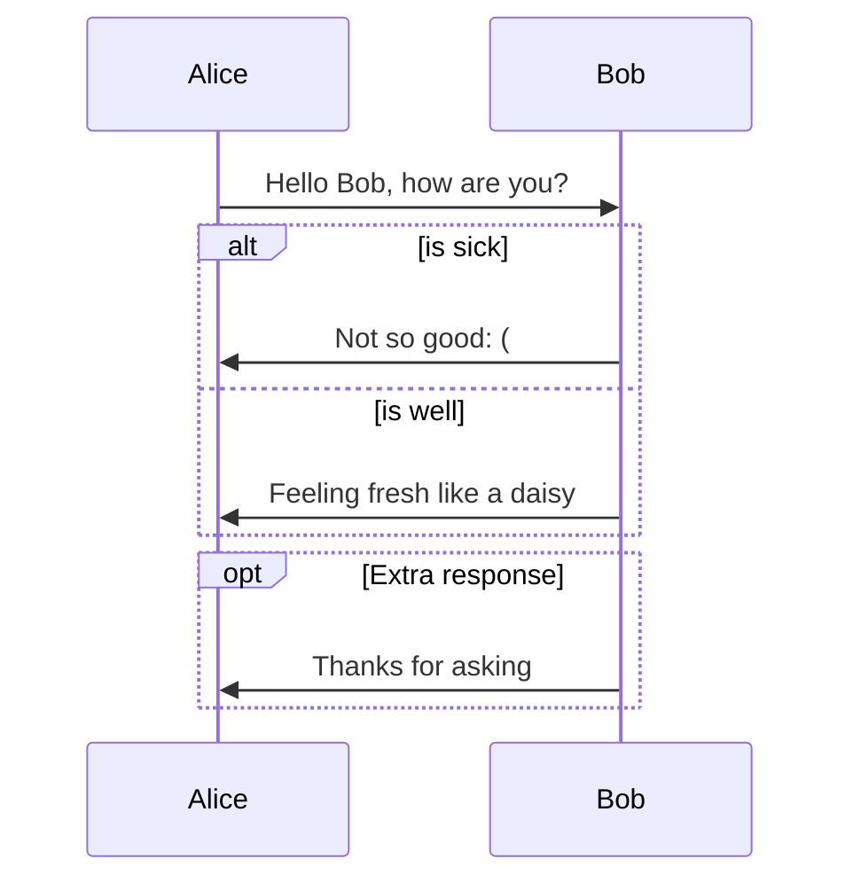
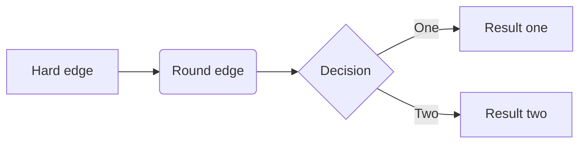
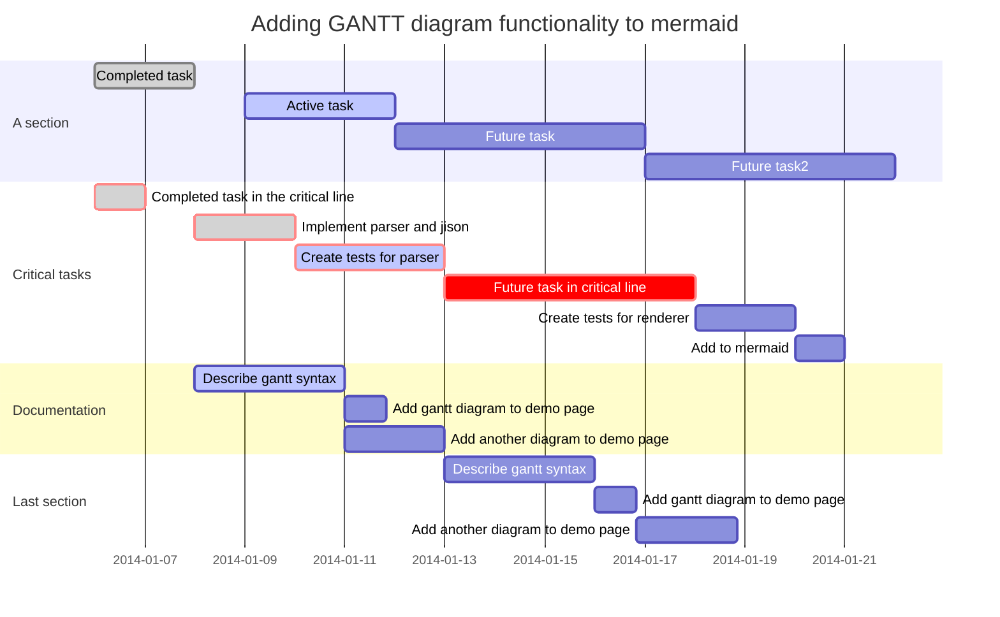

### Welcome Typora Document

---

Thank you for choosing Typora Document.

[toc]

### Headers

---

Headers use 1-6 hash

```markdown
# This is an H1

## This is an H2

### This is an H6
```


### Block Quotes

---

```markdown
> This is a block quote with two paragraphs.
```

### Lists

```markdown
## un-ordered list
* Red
* Green
* Blue

## ordered list
1. Red
2. Green
3. Blue
```

* Red
* Green
* Blue

### Task List

---

```markdown
- [ ] a task list item
- [ ] list syntax required
```

- [ ]  a task list item
- [ ]  list syntax required
- [x]  completed

### Code Blocks

---

**JavaScript**

```javascript
function test() {
    console.log("Hello World")
}
```

---

**python function**

```python
def func(n):
    if n < 0:
        return -1
    elif n == 1 or n == 2:
        return 1
    else:
        return func(n-1) + func(n-2)
result = func(20)
if result != -1:
    print(result)
```

---

**golang**

```go
func main() {
    fmt.Printf("Hello World")
}
```


### Tables

---

| First Header | Second Header |
| ------------ | ------------- |
| 1            | 1             |
| 2            | 2             |

```
| First Header | Second Header |
| ------------ | ------------- |
```

| Left-Aligned  | Center Aligned  | Right Aligned |
| :------------ | :-------------: | ------------: |
| col 3 is      | some wordy text |         $1600 |
| col 2 is      |    centered     |           $12 |
| zebra stripes |    are neat     |            $1 |

| Default | Left | Right | Center |
| ------- | :--- | ----: | :----: |
| 1       | 2    |     3 |   4    |

### Footnotes

---

Python is my [^life]

You can create footnotes like this[^footnote].

[^life]: Hello World
[^footnote]: Here is the *text* of the **footnote**.

### Horizontal Rules

---

***World***

***Hello***


### Internal Links

---

This is [an example][id]

### Images

---


### Emphasis

---

*single asterisks*

-single asterisks-

### Emoji

---

:artificial_satellite: World of Hope

:smile: Hello World


### Draw Diagrams With Markdown

---


#### Sequence

---


```sequence
Alice->Bob: Hello Bob, how are you?
Note right of Bob: Bob thinks
Bob-->Alice: I am good thanks!
```

#### Flowchart

---

```flow
st=>start: Start
op=>operation: Your Operation
cond=>condition: Yes or No?
e=>end

st->op->cond
cond(yes)->e
cond(no)->op
```

#### Mermaid

---



#### Flowchart

---



#### Gantt

---



### Note: important thing

[world](http://www.python.org)

~~slot~~

<!---->

`hello world`

> world of animals

